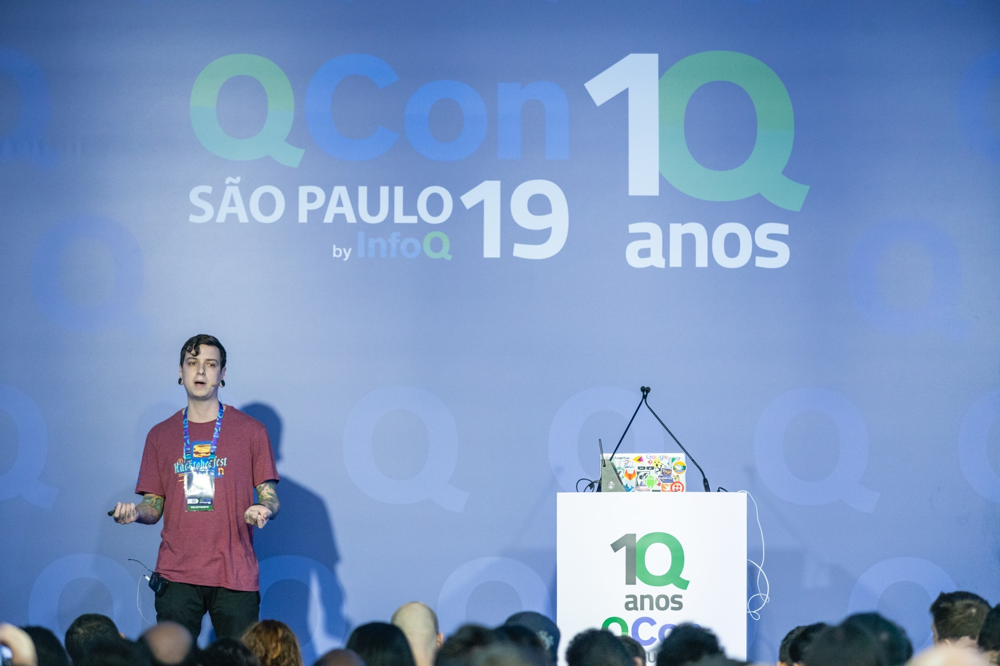

Sou formado em análise e desenvolvimento de sistemas pela [Unip](https://unip.br), engineering lead na [Creditas](https://www.creditas.com), desenvolvedor, instrutor, palestrante e pai do Vicente.

Nasci e moro em São Paulo, trabalho há mais de 9 anos no mercado de tecnologia e neste perído trabalhei em grandes empresas de tecnologia como [Vagas](https://vagas.com.br), [Isobar](https://isobar.com), [99jobs](https://99jobs.com), [Easynvest](https://easynvest.com.br), [Digibee](https://digibee.com) e [Grupo ZAP](https://grupozap.com).

Gosto bastante de contribuir com a comunidade de tecnologia no meu tempo livre. Tenho alguns cursos e aulas gratuitas na [Digital Innovation One](https://digitalinnovation.one) e também já participei de meetups e grandes eventos de tecnologia como a [TDC](https://thedevconf.com/palestrante/celso-henrique-da-silva), [QConSP](https://qconsp.com/speakers/celso-henrique) e Facebook Dev Circles.