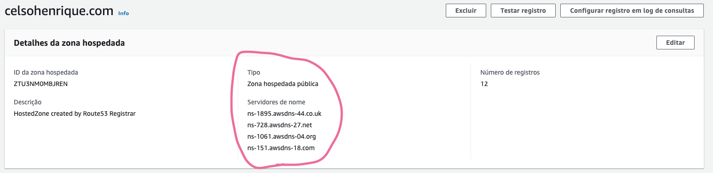
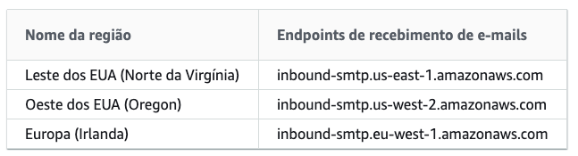
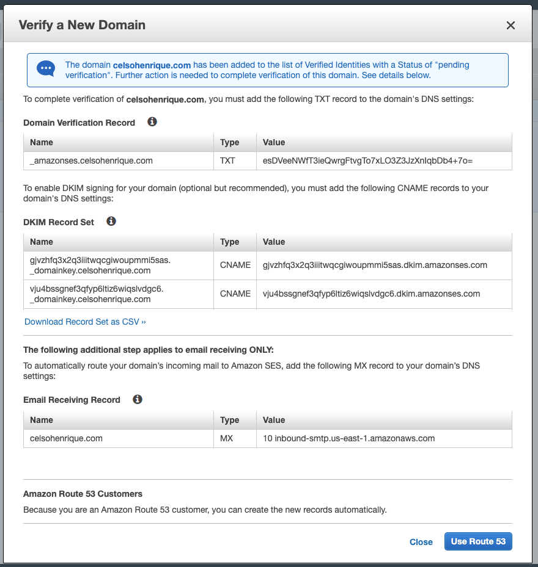
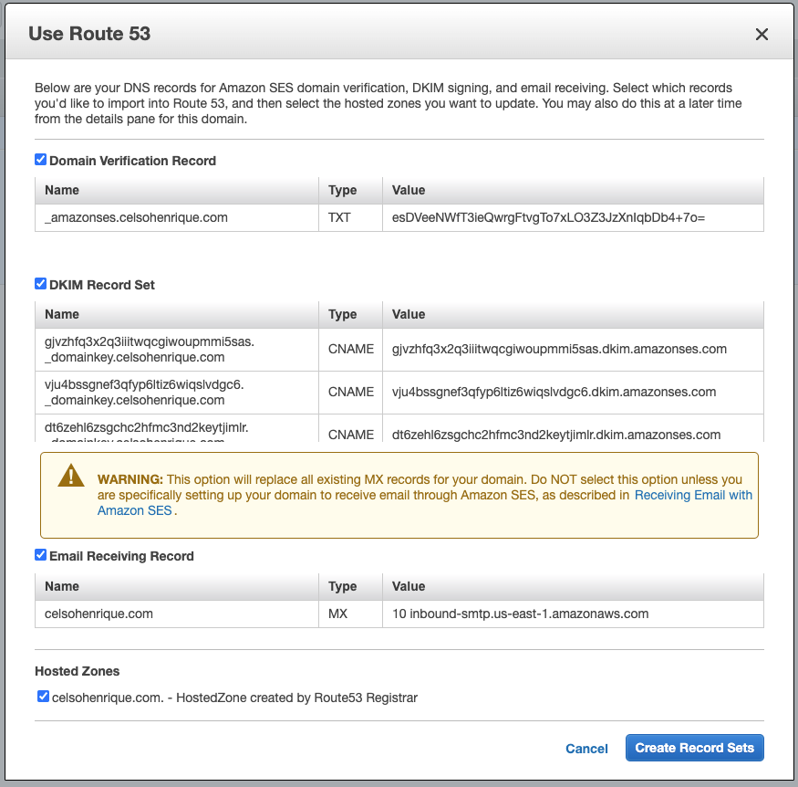
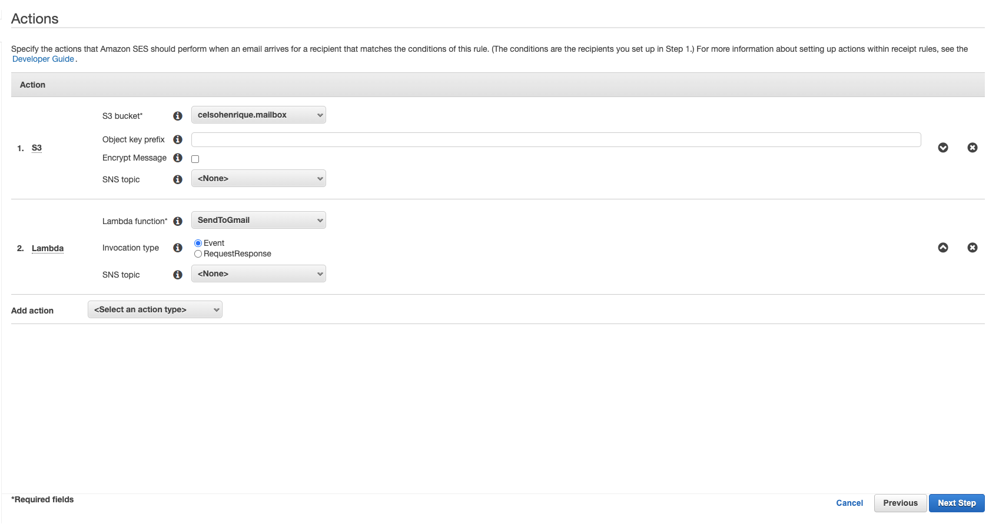

Olá, hoje inauguro o meu blog e nada mais justo do que descrever a infraestrutura usada para recebimento de e-mails aqui. Primeiro gostaria de deixar o artigo que usei como referência aqui [neste link](https://infra.engineer/aws/11-using-gmail-with-your-domain-utilising-aws-ses-lambda) e dizer que acrescentei pontos neste guia, principalmente onde tive dificuldades, acredito que podem auxiliar quem queira fazer o mesmo.

A ideia ao utilizar esta arquitetura é aproveitar os serviços que a AWS disponibiliza, usando o limite de uso gratuito ou pagando o mínimo possível,  centralizando o recebimento no seu Gmail ou similar. Ao final deste guia você poderá receber e responder e-mails do seu domínio através da sua caixa de e-mails particular. Vamos lá?

## Route 53

A primeira etapa é criar uma zona hospedada para o seu domínio no Route 53. Com sua conta logada busque por Route 53, caso você tenha registrado o seu domínio utilizando a AWS ele já deverá estar listado como zona hospedada, caso seu domínio esteja registrado usando outro provedor, você pode conferir [neste link](https://docs.aws.amazon.com/pt_br/Route53/latest/DeveloperGuide/MigratingDNS.html) o processo para migrar seu domínio para a AWS. Resumidamente você deverá apontar os servidores de nome do seu domínio para os descritos na zona hospedada, como no exemplo abaixo:



Após isto, podemos partir para as configurações do SES uma vez que temos controle sobre os registros de DNS do nosso domínio.

## Simple E-mail Service

Agora vamos iniciar o processo de criação de domínio no SES, primeiramente busque por "Simple E-mail Service" e acesse-o, verifique a região em que está utilizando o serviço, pois como iremos receber e-mails usando o SES devemos escolher uma das regiões abaixo onde existem endpoints de recebimento:



Agora clique no sessão "Domains" no lado esquerdo e na opção "Verify a New Domain", coloque o nome do seu domínio e marque a opção "Generate DKIM Records", pressione em "Verify".




Pressione em use Route 53 e marque a opção e-mail receiving record, como abaixo:



Após isto a AWS irá verificar o seu domínio e o seus status deverá ser alterado para "verified". Este processo pode levar até 72h, mas no meu caso levou apenas alguns minutos. Após esta validação estamos prontos para receber e enviar e-mails através do SES.

## S3

Agora vamos para a configuração do nosso bucket no S3 que será responsável por armazenar os e-mails recebidos e que, posteriormente, serão encaminhados para nosso e-mail particular através de uma lambda. Dentro do serviço do S3, crie um novo bucket, com um nome do fácil de memorizar e na mesma região onde configurou o SES.

Após a criação, vá para "permissões" -> "política de bucket" e insira o JSON abaixo:

```json
{
    "Version": "2012-10-17",
    "Statement": [
        {
            "Sid": "AllowSESPuts",
            "Effect": "Allow",
            "Principal": {
                "Service": "ses.amazonaws.com"
            },
            "Action": "s3:PutObject",
            "Resource": "arn:aws:s3:::NOME-DO-BUCKET/*",
            "Condition": {
                "StringEquals": {
                    "aws:Referer": "NUMERO-ID-AWS"
                }
            }
        }
    ]
}
```

Substitua "NOME-DO-BUCKET" pelo nome do bucket criado e o "NUMERO-ID-AWS" pelo seu ID da conta da AWS, ele pode ser encontrado dentro do serviço IAM da AWS, na canto inferior esquerdo.

## Lambda

Para a lambda que será responsável por encaminhar os e-mails para nossa conta, iremos utilizar o código disponível [neste repositório](https://github.com/arithmetric/aws-lambda-ses-forwarder), ele altera os cabeçalhos de envio, tornando possível responder no nosso e-mail particular quem nos enviou o e-mail. 

Primeiro abra o serviço de lambda na AWS e clique em "Criar Função", selecione a opção "Criar do Zero", dê um nome para sua função e selecione o tempo de execução como `Node.js 12.x`, mantenha as permissões padrões.  Agora siga os passos abaixo:

- Para o código da função copie o conteúdo do arquivo `index.js` que está no repositório acima;
- Confira se o manipulador está como `index.handler`;
- Na aba permissões, clique em editar -> Visualize a função nome-da-funcao no console do IAM, na nova janela clique em adicionar políticas em linha, clique em JSON e cole o código abaixo:

```json
{
   "Version": "2012-10-17",
   "Statement": [
      {
         "Effect": "Allow",
         "Action": [
            "logs:CreateLogGroup",
            "logs:CreateLogStream",
            "logs:PutLogEvents"
         ],
         "Resource": "arn:aws:logs:*:*:*"
      },
      {
         "Effect": "Allow",
         "Action": "ses:SendRawEmail",
         "Resource": "*"
      },
      {
         "Effect": "Allow",
         "Action": [
            "s3:GetObject",
            "s3:PutObject"
         ],
         "Resource": "arn:aws:s3:::NOME-DO-BUCKET/*"
      }
   ]
}
```

Substitua o "NOME-DO-BUCKET" pelo nome do bucket criado anteriormente e aplique a política na sua Lambda, assim ela pode acessar os recursos do seu bucket.

- Configure a memória e timeout da lambda (Para e-mails simples 128mb de memória e 5s de timeout devem ser suficientes);
- Altere o início do código da lambda que copiamos anteriormente com as informações abaixo:

```js
var defaultConfig = {
  fromEmail: "seuemail@seudominio.com", // E-mail que encaminhará para você
  subjectPrefix: "Lambda/SES - ", // Prefixo do título do e-mail
  emailBucket: "NOME-DO-BUCKET", // Nome do bucket com os e-mails
  emailKeyPrefix: "", 
  forwardMapping: {
    "contato@seudominio.com": [ // E-mails recebidos no "contato@seudominio.com" serão encaminhados para "seuemailparticular@gmail.com"
      "seuemailparticular@gmail.com"
    ],
    "@seudominio.com": [ // Todos e-mails recebidos serão encaminhados para "seuemailparticular@gmail.com"
      "seuemailparticular@gmail.com"
    ]
  }
};
```

## SES - Configurações finais

Agora vamos conectar nosso bucket e nossa lambda ao SES, dentro do SES clique em "Rule Sets" e clique em "Create Rule". Coloque o nome do seu domínio no "recipient" e clique em "Add Recipient".

Agora em actions, selecione a opção "S3" e selecione o bucket criado anteriormente, selecione "lambda" e escolha a lambda criada anteriormente. Após isto devemos ter algo assim:



Avance para o próximo passo, dê um nome para sua rule, eu coloquei como "celsohenrique.com.email.forwarding", confira os dados e finalize. Caso solicite adições de permissões na lambda, apenas confirme.

Pronto,  se tudo deu certo o processo de recebimento de e-mails já está funcionando, agora basta configurarmos o envio.

## Envio de e-mails

Para enviar e-mails devemos anotar nosso servidor SMTP e criar credenciais, para isso dentro do serviço SES  clique em "SMTP Settings", anote os dados do servidor e clique em "Create my SMTP credentials".  Siga os passos e baixe seu usuário e senha do servidor SMTP. Por padrão o SES está no modo sandbox, o que permite que enviemos apenas 200 e-mails por dia e apenas para e-mails verificados através da sessão "Email Addresses" no lado esquerdo. Para removermos nossa conta do sandbox basta criar um ticket na AWS seguindo os passos descritos [neste link](https://docs.aws.amazon.com/ses/latest/DeveloperGuide/request-production-access.html).

Finalmente vamos ao nosso Gmail configura-lo para envio de e-mails usando nosso domínio, para isso abra seu Gmail clique na engrenagem -> "Ver todas configurações" -> "Contas e importações" e clique em "Adicionar outro endereço de e-mail", no popup insira o endereço de e-mail que deseja utilizar para envio do seu domínio, preencha com os dados do SMTP anotados anteriormente e preencha com suas credenciais criadas. Agora você pode enviar e-mails usando seu domínio!

## Problemas comuns

Caso ocorram problemas de envio ou recebimento verifique o Cloudwatch da sua lambda, lá estarão os logs das execuções. Geralmente os problemas são limitações de permissões no bucket, lambda ou sandbox. 

Isto é tudo pessoal, espero que tenham gostado e até a próxima.